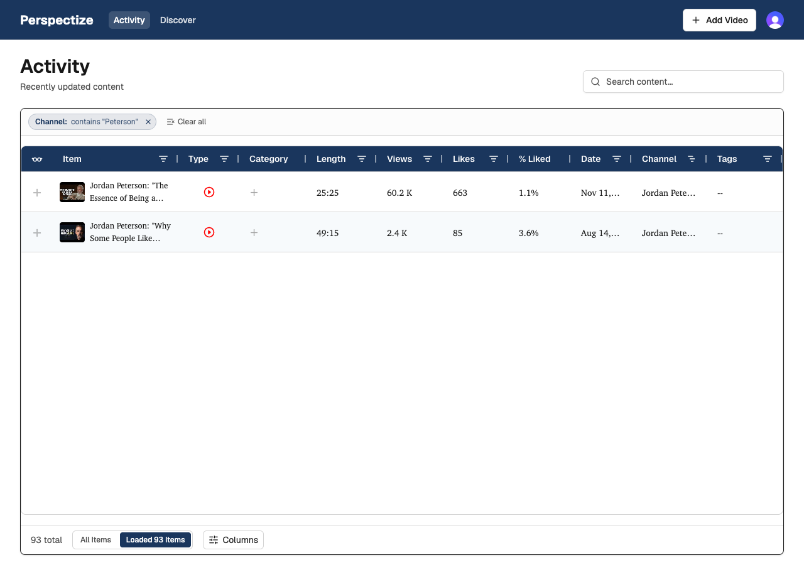
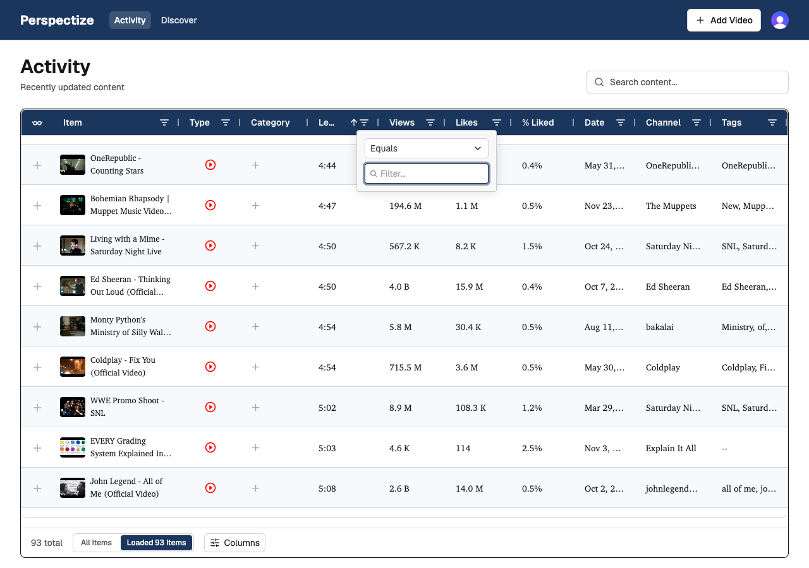
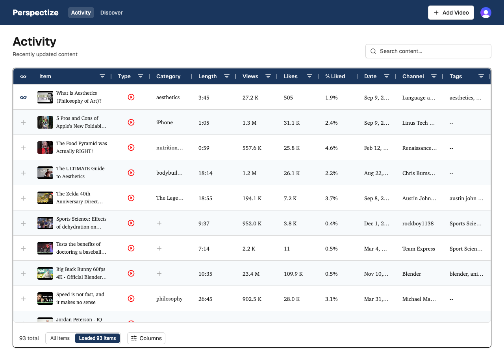
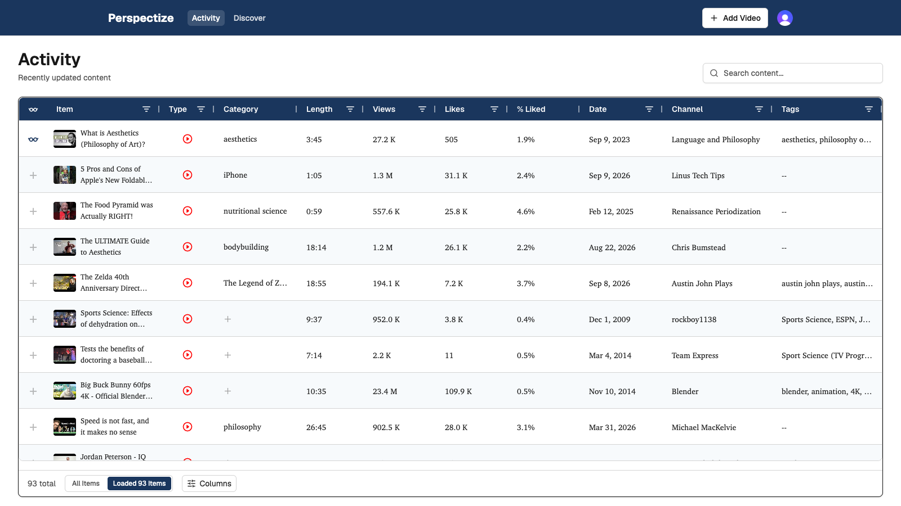

# Visual bug sweep — Activity page (localhost:5173)

Date: 2026-09-10
Branch: `bugfix/visual-sweep` (worktree `.claude/worktrees/1`)
Method: Chrome DevTools MCP, click/hover/keyboard-driven exploration of the Activity table (headers, sort, filters, popovers, pagination, responsive breakpoints) and the Discover page.

**Unit test philosophy applied below** (per project owner): a UI element with only one possible state doesn't need a test — you can just look at it. An element that *has* state, or *triggers* state changes, needs each distinct state exercised by a test, so a regression in a specific state can't silently slip through unnoticed.

**False alarms ruled out during this sweep** (noted so they aren't re-investigated): a `fullPage:true` screenshot of the virtualized grid produces a stitching artifact that looks like overlapping column text — not reproducible with a plain viewport screenshot, so it isn't a real bug. Lazy-loaded thumbnails appearing blank in an early screenshot were just late image loads. A 404 on one video's `hqdefault.jpg` (private YouTube video) is a known, already-tracked case — excluded here per the user.

---

## 1. [P1] "Loaded N Items" count doesn't update when a column filter narrows the client-side view

**Where:** `frontend/src/lib/components/ActivityTable.svelte:931` (`<DataModeToggle {mode} loadedCount={rowData.length} .../>`) and the `onFilterChanged` handler at `ActivityTable.svelte:690-694`.

**Repro:** Activity page, in default "Loaded N Items" (client-side) mode → open the "Channel" column filter → type "Peterson".

**Actual:** the grid correctly narrows to the 2 matching rows, but the footer still reads **"93 total"** and the toggle button still reads **"Loaded 93 Items"** — both stuck at the unfiltered count:


**Expected (for comparison — the same filter in "All Items"/server mode updates the count correctly to "2 total"):** confirmed working correctly in that mode during this sweep; only client-side "Loaded" mode has the stale-count problem.

**Root cause:** `onFilterChanged` explicitly no-ops for `mode === 'loaded'` (`ActivityTable.svelte:694`, "AG Grid handles client-side filter — skip URL update") — reasonable for not touching the URL, but as a side effect nothing ever recomputes a filtered row count. The `DataModeToggle` button is passed `loadedCount={rowData.length}` (`ActivityTable.svelte:931`), which is the full unfiltered array length, not AG Grid's actual displayed/filtered row count. Given the button's own accessibility description is "Sort, filter, and search within the currently loaded page only," showing "Loaded 93 Items" while 2 rows are visible actively misinforms the user about how many items their filter matched.

**Suggested fix:** track the grid's live displayed row count and use it for both labels while a client-side filter is active, e.g.:
```ts
let displayedRowCount = $state(rowData.length);

onFilterChanged: (event: FilterChangedEvent) => {
  activeFilterModel = event.api.getFilterModel();
  displayedRowCount = event.api.getDisplayedRowCount(); // NEW

  if (mode === 'loaded') return;
  // ...
},
```
```svelte
<DataModeToggle {mode} loadedCount={displayedRowCount} onToggle={handleModeToggle} />
```
(and decide whether the separate `{totalCount} total` label should keep showing the whole-library total, or also reflect the active filter — worth clarifying intent with design, since the two labels currently mean different things but sit right next to each other.)

**Worth a unit test?** Yes — this is squarely a stateful-UI case per the project's testing philosophy: "no filter" vs "filter narrows results" are two distinct states of the same counter, and a regression here silently shows a wrong number rather than crashing anything. `grid-config.ts` already exists for extracting pure, testable AG Grid logic (per `frontend/CLAUDE.md`) — a good place for a `getDisplayedCountLabel()`-style helper that can be unit tested directly, backed by a Vitest Browser Mode/Playwright test that types into a column filter and asserts the "Loaded N Items" label matches the actual visible row count.

---

## 2. [P2] Sorting a short-named column truncates its own header label ("Length" → "Le…")

**Where:** `frontend/src/lib/components/ActivityTable.svelte` header, any sortable+filterable column with a short name (repro'd on "Length").

**Repro:** Activity page → click the "Length" column header to sort ascending.

**Actual:**


**Expected** (unsorted state, for comparison — full label renders fine):
See `sv-02-date-column-truncation-expected-1600w.png` header row, or simply the pre-sort screenshot — "Length" renders in full before any sort is applied.

**Root cause:** `headerMinWidth()` in `frontend/src/lib/utils/formatting.ts` estimates a column's minimum width from the header text length plus fixed em-budgets for the sort icon (`sortIconEm = 1.2`) and filter icon (`filterIconEm = 1.5`). Measured live in the browser, once a sort is actually active the rendered label area (`.ag-header-cell-label`) is only **64px** wide inside a **112px** header cell — too small for "Length" at the grid's font size, so AG Grid ellipsizes it to "Le…". The estimate doesn't leave enough real margin once the sort indicator is actually painted (vs. just reserved for).

**Suggested fix:** pad the formula's assumed icon width (e.g. bump `sortIconEm` or add a small fixed safety buffer in px), or give short-named sortable/filterable columns (`Length`, `Date`, `Views`, `Likes`, `Type`) an explicit `minWidth` override the way `Item`/`channel`/`description` already do at `ActivityTable.svelte:396,587,598,609`, instead of relying purely on the em-based estimate:
```ts
// formatting.ts — headerMinWidth()
// widen the reserved icon budget so it matches what's actually painted
// once a sort indicator is shown, not just what's reserved for it
const sortIconEm = 1.6; // was 1.2
```

**Worth a unit test?** Yes. This is a genuinely stateful UI element — the header has at least 3 distinct states (unsorted / ascending / descending) with different icon layouts, and a regression here silently truncates a label without anything else breaking. AG Grid doesn't render in jsdom (per this repo's existing gotcha), so this belongs in Vitest Browser Mode or Playwright: assert `header.scrollWidth <= header.clientWidth` (no overflow) for each short-named column in each sort state.

---

## 3. [P2] "Date" column truncates full dates at common desktop widths

**Where:** `frontend/src/lib/components/ActivityTable.svelte:495-507` (`publishDate` colDef).

**Repro:** Activity page at 1280px viewport width (a standard desktop breakpoint per this repo's own `.docs/VERIFICATION.md` screenshot convention).

**Actual (1280px — dates truncate, e.g. "Sep 9, 2…"):**


**Expected (1600px — same data, full dates render, e.g. "Sep 9, 2023"):**


**Root cause:** the `publishDate` colDef relies on `minWidth: col.minWidth ?? headerMinWidth(col.headerName ?? '', ...)` (`ActivityTable.svelte:618`), and `headerMinWidth('Date', true)` sizes the column only from the 4-character header label "Date" — not from the actual formatted cell content ("Sep 9, 2023", ~11 characters). Once other columns compete for flex space at moderate widths, the Date column shrinks to a width that fits its header but not its own data, and every date gets an ellipsis.

**Suggested fix:** give `publishDate` (and any other column whose displayed *value* is reliably longer than its header) an explicit `minWidth`, the same way `Item`/`channel`/`description` already override the generic estimate:
```ts
{
  colId: 'publishDate',
  field: 'publishedAt',
  headerName: 'Date',
  flex: 1,
  maxWidth: 150,
  minWidth: 130, // fits "Sep 9, 2023"-style formatted dates, not just the header label
  ...
}
```

**Worth a unit test?** Borderline — this is less a toggleable UI state and more a single layout parameter (a fixed date format at a range of viewport widths). Still, viewport width is effectively the "state" this column must handle, and it's already visibly wrong at a width this project explicitly tests at (1280px, per `VERIFICATION.md`). A lightweight assertion is worth adding if/when `headerMinWidth` is touched again: verify computed `minWidth` for date-like columns against a sample formatted value, not just the header text length. Not worth a dedicated new test file on its own.

---

## 4. [P4] Category-search popover has no visual anchor and fully covers the row beneath it

**Where:** `frontend/src/lib/components/ActivityTable.svelte` (`categoryPopoverPosition` / category cell click handler, ~line 644-659).

**Repro:** Activity page → click any cell in the "Category" column.

**Observed:** the Wikidata search popover opens flush against the bottom-left of the clicked cell with no arrow/caret and no backdrop dimming, so it renders as an opaque box directly on top of the *next* row's Item thumbnail/title/category — that row is fully hidden while the popover is open, with nothing visually tying the popover back to the cell that opened it.

**Suggested fix:** either add a small pointer/caret to the popover pointing at its origin cell (many popover libs support this, including the shadcn `Popover` primitive already used elsewhere in this codebase — worth switching to instead of the manual `{x, y}` rect math), or bias the popover's vertical offset so it doesn't fully occlude the next row when there's a row directly below.

**Worth a unit test?** No — this is a single visual state (a fixed-position popup relative to one click), nothing here is toggled or has distinct behavioral variants to regress against. A quick look is enough to catch a future regression.

---

## 5. [P3, needs confirmation] Grid scroll position isn't reset when switching "Loaded" ↔ "All Items" data mode

**Where:** `frontend/src/lib/components/ActivityTable.svelte`, the `$effect` that reacts to `mode`/page changes.

**Repro:** Activity page → scroll the table down → click "All Items" (or "Loaded N Items") to switch data mode.

**Observed:** at a small residual `.ag-body-viewport` scrollTop (confirmed misrendering at 36px), the newly-loaded first row renders half-hidden underneath the sticky header row instead of scrolling back to the top.

**Caveat:** my repro scrolled the grid via a large programmatic jump (`viewport.scrollTop = 2200`) rather than genuine mouse-wheel/trackpad scrolling before toggling mode — I did not confirm a real user's scroll-then-toggle produces the same residual offset. **Recommend a human spot-check** (scroll the table a few rows down with the mouse wheel, then click "All Items"/"Loaded N Items") before prioritizing a fix.

**Suggested fix, if confirmed:** in the effect that swaps row data on `mode`/page change, explicitly reset scroll after the swap:
```ts
// after applying new rowData / mode
gridApi.ensureIndexVisible(0, 'top');
```

**Worth a unit test?** Yes, if confirmed — "Loaded" vs "All Items" are two distinct, real states of this component, and a scroll-reset regression is exactly the kind of thing that could silently break again later. Covered via Vitest Browser Mode/Playwright (per this repo's existing AG Grid testing conventions): scroll down, toggle mode, assert the first row's top edge is fully below the header's bottom edge.

---

## Summary

| # | Priority | Issue | Test recommended? |
|---|----------|-------|--------------------|
| 1 | P1 | "Loaded N Items"/total count stale after client-side filter | Yes — stateful (filtered vs unfiltered) |
| 2 | P2 | Sorted column header truncates ("Length" → "Le…") | Yes — stateful (sort states) |
| 3 | P2 | Date column truncates at 1280px | Optional/lightweight — mostly static layout |
| 4 | P4 | Category popover has no anchor, covers row below | No — single visual state |
| 5 | P3 (unconfirmed) | Scroll position not reset on data-mode switch | Yes, if confirmed — stateful (mode toggle) |

Per plan: this `visual-sweep/` folder (screenshots + this report) should be deleted as the last commit once the above are fixed.
